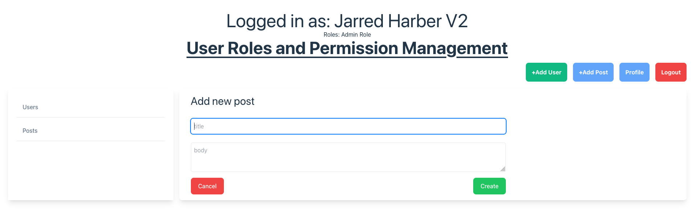
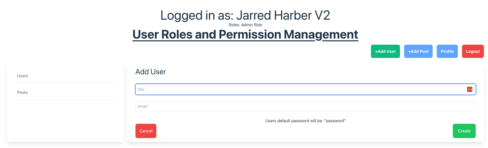
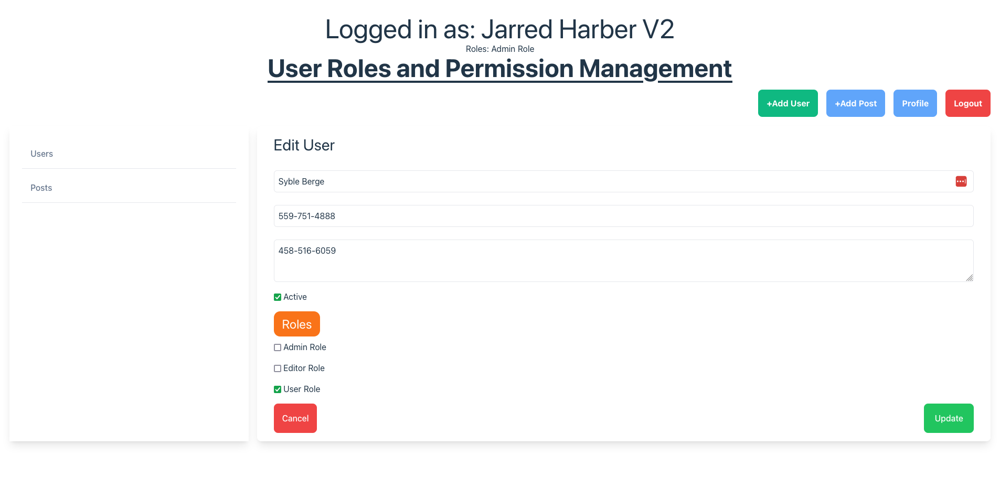
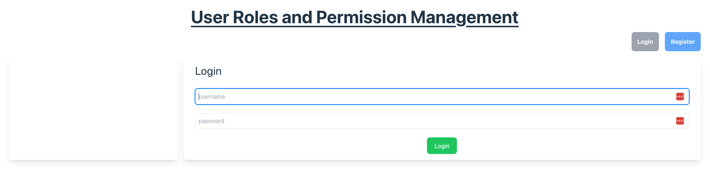
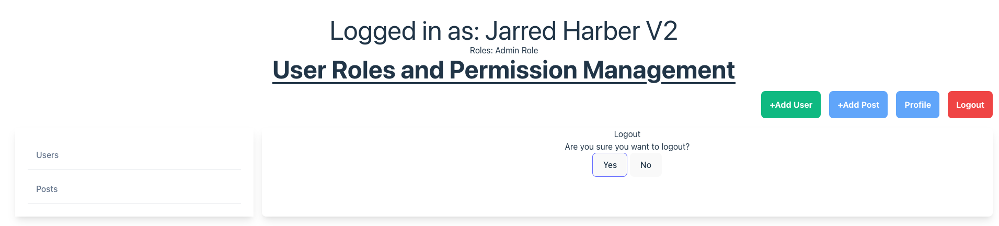
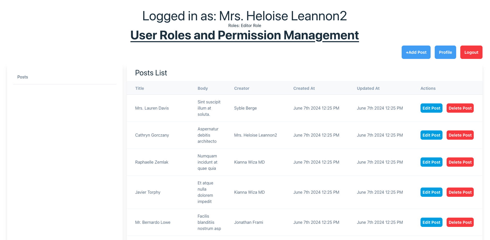
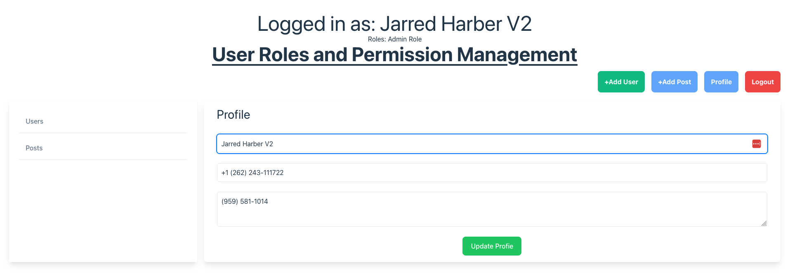
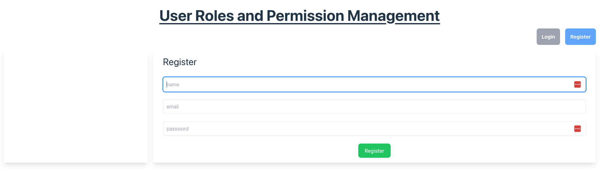
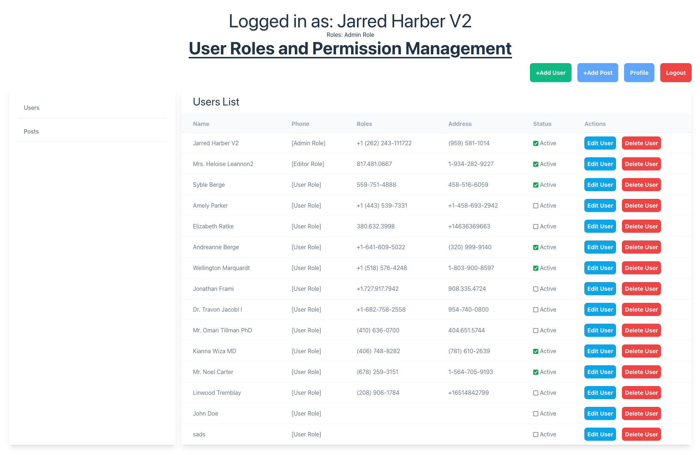

# Project Name: Springboot and ReactNative Money Transfer Android Mobile and Web Application

## Project Status: Work In Progress

## Functional Requirement Items (some in the workings)
- Create new user
- See users list
- Create new post
- See users post
- Update User profile
- Login and Logout Functionality
- Registration Functionality
- Assign and unassign roles to users with an admin-role role.
- Editor role can only create, edit and delete all posts
- User role can only create, edit and delete his posts
- Admin role can add, edit and delete users. He can also create, update and delete all posts.
- All roles can view and update their user profiles
- Add d3.js statistics page to show user post creation over time - `WIP`

## Technical Requirement Items (some in the workings)
- UsersController and PostsController tests
- User roles and access control in backend using policies and controller gates. This is done usng Laravel Sanctum
- Finish up docker files setup for development and deployment - `WIP`
- Add more extensive test to cober AuthController and UserProfileController tests - `WIP`
- Add cypress end to end testing - `WIP`
- Secure auth token storage on frontend. Currently stored as plaintext - `WIP`
- Centralize and make better the error handling from bacend api calls - `WIP`
- Add token refresh mechanism or detect when it is expired or invalidated - `WIP`

# How to run
### Laravel Server
```
cd rlaravel-foldereact-folder
```
```
php artisan serve
```

### React Server
```
cd react-folder
```
```
npm run dev
```

# Screens

